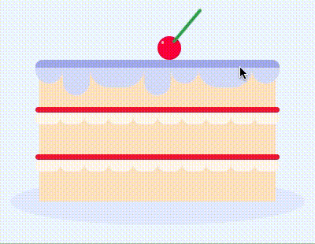

## Make This Cake challenge

### Links

- [Live site URL here](https://laughing-almeida-fce662.netlify.app)

## My process

### Built with

- HTML
- SCSS
- Flexbox

### What I learned

Testing out using SCSS and using BEM naming techniques.

I enjoyed applying CSS `transition: height 0.5s` to make the icing drip on hover.

Playing around with an infinite colour animation on the jam turning it into chocolate filling.

